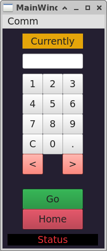
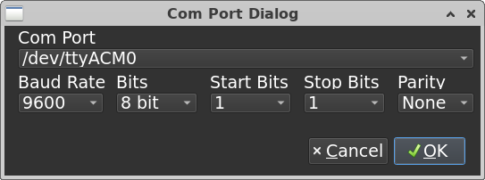
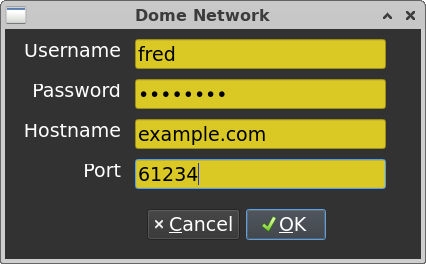

# DomeControl
Hardware and Software for an Arduino based Dome Controller for Exploradomes.

The main window displays the current position in the "Currently" window,
initialized to the text until a valid location is entered.

Degrees may be integer, or floats. A constant offset is maintained in the code.

The less-than and greater-than buttons allow to jog one step. Useful when observing
to bump the dome a tad without a lot of thought.

The keypad is used to enter the degrees, or it can be typed into the blank
space.

The "Go" button sends the value to the controller.

The "Home" button sends a HOME command to the controller. This should be
installed in the Parked Position. May add a PARK button if desired.

Currently a Serial Port connection is planned, but a dialog is used
to capture a possible server location at a network location.

The Com Port Dialog -- currently wired for Linux, allows a device to be entered.
ttyACM0 is a common default location for Arduino devices.

The baudrate and other serial connection parameters default to the common value
for serial devices for the Arduino.

OK accepts the values into the main program, and the connection is modified.

The network connection requires a user name, password (hidden when typing),
a hostname and port. These values are accepted into the program with the
OK button.

If the OK for Com dialog is used, the method switches to that mode.

If the OK for the Network dialog is used, then the comm method swithches
to attaching to the network server.

#To Do

Add the actual port communication.
Make the network server.

Make more platform friendly.

